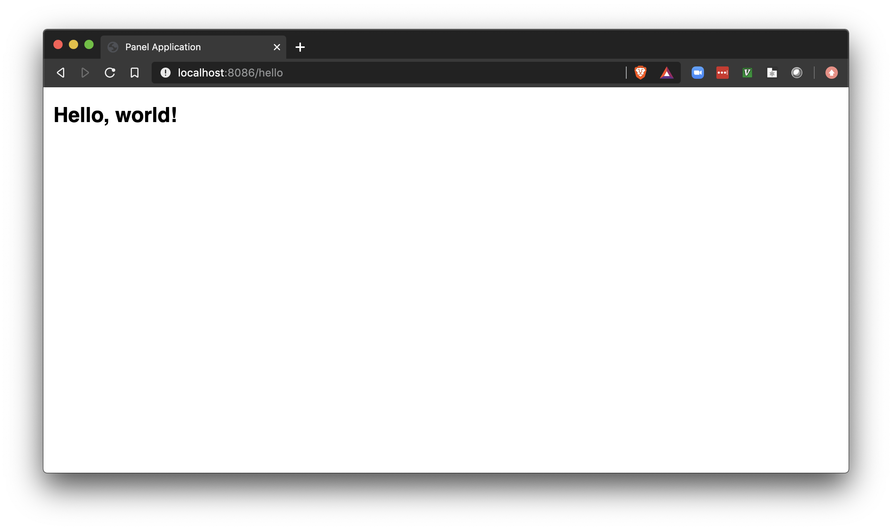

# Anaconda Project builder image

Build docker images from Anaconda Project directories.

## Usage

1. Install [source-to-image](https://github.com/openshift/source-to-image#installation)
2. Optional: Clone this repo and build the base images
```
git clone https://github.com/Anaconda-Platform/s2i-anaconda-project
cd s2i-anaconda-project
make
```

3. Build your own docker image from an Anaconda Project directory

```
s2i build <path-to-project or URL> conda/s2i-anaconda-project-ubi7 <image-name> [-e CMD=<project-command>]
```

* `<image-name>` is the desired Docker image name.
* `<project-command>` is the anaconda-project command to run when `docker run` is executed (optional).

4. Run the docker image
```
docker run -p 8086:8086 <image-name>
```


## Example

Here is an example using the [Hello World](https://github.com/AlbertDeFusco/hello-world) project on Github.


```
>s2i build https://github.com/AlbertDeFusco/hello-world.git conda/s2i-anaconda-project-ubi7 hello-world
error: Unable to load docker config: json: cannot unmarshal string into Go value of type docker.dockerConfig
---> Copying project...
---> Preparing environments...
Nothing to clean up for environment 'default'.
Cleaned.
$ conda create --yes --prefix /opt/app-root/src/envs/default python=3.7 panel
Collecting package metadata (current_repodata.json): ...working... done
Solving environment: ...working... done

## Package Plan ##

environment location: /opt/app-root/src/envs/default

added / updated specs:
- panel
- python=3.7


The following packages will be downloaded:
...
Will remove the following packages:
/opt/app-root/src/.conda/pkgs
-----------------------------

_libgcc_mutex-0.1-main                         7 KB
numpy-1.18.1-py37h4f9e942_0                   24 KB
blas-1.0-mkl                                  15 KB

---------------------------------------------------
Total:                                        46 KB

removing _libgcc_mutex-0.1-main
removing numpy-1.18.1-py37h4f9e942_0
removing blas-1.0-mkl
Build completed successfully
```

You can find the `hello-world` Docker image in your local registry.

```
>docker image ls
REPOSITORY                                       TAG                 IMAGE ID            CREATED             SIZE
hello-world                                      latest              eeb7153e78d3        35 seconds ago      1.96GB
conda/anaconda-project-ubi7                      latest              c3b1890888f8        2 minutes ago       809MB
conda/anaconda-project-centos7                   latest              2f6ce578489b        3 minutes ago       796MB
registry.access.redhat.com/ubi7/s2i-base         latest              7fe1e99b3821        7 weeks ago         471MB
centos                                           7                   5e35e350aded        5 months ago        203MB
openshift/base-centos7                           latest              4842f0bd3d61        3 years ago         383MB
```

Now run the `hello-world` Docker image

```
>docker run -p 8086:8086 hello-world
2020-04-20 17:52:06,460 Starting Bokeh server version 2.0.1 (running on Tornado 6.0.4)
2020-04-20 17:52:06,463 User authentication hooks NOT provided (default user enabled)
2020-04-20 17:52:06,465 Bokeh app running at: http://localhost:8086/hello
2020-04-20 17:52:06,465 Starting Bokeh server with process id: 1
```

When you visit http://localhost:8086 you will see


